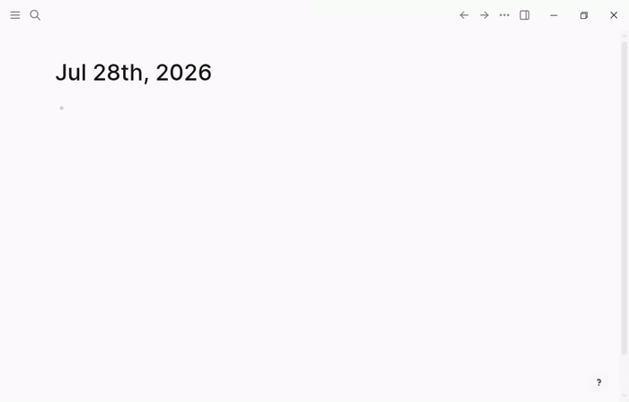

# logseq-plugin-zetlify

Turn any block — with or without children — into its own timestamp-named page,
and replace the original block with an embed pointing at it.



## Why

This started as a personal itch: a Zettelkasten-like flow where an idea gets
its own file or page, one idea per page, so the notes graph reflects actual
atomic ideas rather than folders of loosely related bullets.

Creating a Logseq page the normal way means naming it upfront — but most
insights arrive before they deserve a name. Forcing a title too early either
stalls the capture or saddles the idea with a title that doesn't fit once
it's developed.

Journaling around the problem doesn't fully solve it either: a daily journal
page is a fine capture surface, but insights show up in short, varied bites
that a single page can't hold cohesively over time — a day's journal ends up
as a grab-bag of unrelated fragments instead of one traceable thread per idea.

Logseq's block references could technically link ideas without a page split,
but that keeps everything nested inside whichever page the idea was jotted
in. What's needed is page-level storage: each idea as its own node in the
notes graph, portable to other note-taking apps (e.g. Obsidian) that think in
pages/files rather than Logseq's block tree. Hence `/zetlify` — capture the
block first, name comes later (or never, via the timestamp), and only then
does it get promoted to a page of its own.

## What it does

Typing `/zetlify` in any block and invoking it will:

1. Create a new page named with a timestamp, e.g. `2026020609324510`
   (format `yyyymmddhhmmssxx`, 24-hour clock, `xx` = centiseconds).
2. Move the invoked block's own content onto the new page as its first block.
3. Move the invoked block's children onto the new page (in order), preserving
   their UUIDs so existing block references keep working.
4. Rewrite the original block in place as `{{embed [[<page name>]]}}`.

Two rapid invocations are guaranteed to never collide on the same page name.

## Install (unpacked, for development / before marketplace listing)

1. Clone this repo and install dependencies:
   ```bash
   pnpm install
   pnpm build
   ```
2. In Logseq: **Settings → turn on Developer mode**.
3. Open the plugins dashboard (`t p` or via the toolbar) → **Load unpacked plugin**
   → select this repo's root directory (the one containing `package.json`).
4. In any block, type `/zetlify` and select **Zetlify**.

## Development

```bash
pnpm dev        # Vite dev server with HMR via vite-plugin-logseq
pnpm typecheck  # tsc --noEmit
pnpm build      # production build into dist/
pnpm demo:gif   # regenerate docs/demo.gif — drives a real Logseq desktop via the
                # Tier-2 Playwright harness (see e2e/), requires `pnpm build` first
```

## Documentation

See [`docs/architecture.md`](docs/architecture.md) for design decisions
(stack choice, page-naming scheme, block move semantics, CI/CD) — grounded in
the rationale above.

## License

MIT
